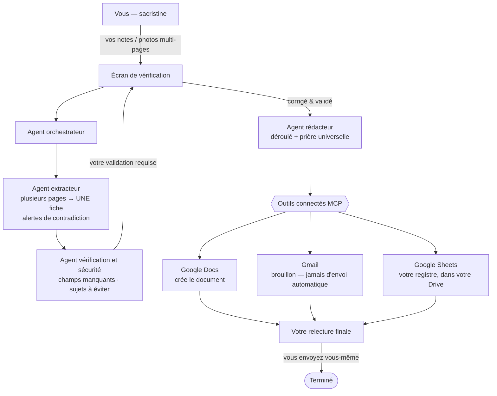

<!-- 🌍 Langue : **Français** · [English](README.md) -->
🌍 **Français** · [English](README.md)

# Assistant Obsèques
### Un copilote IA, sous contrôle humain, pour préparer les cérémonies d'obsèques

<!-- TODO : image de couverture -->
<!--  -->

> **Cet outil ne cherche pas à automatiser le deuil. Il automatise la partie
> répétitive et administrative pour vous laisser plus de temps auprès des
> familles, avec attention et humanité.**

- 🔗 **Démo :** <!-- TODO -->
- 🎥 **Vidéo de présentation :** <!-- TODO -->

---

## À quoi ça sert

Préparer une cérémonie d'obsèques demande beaucoup de temps. Vous rencontrez la
famille, vous notez la personnalité du défunt, les souhaits des proches, les
lectures, les chants, les lecteurs, les intentions de prière — souvent sur
**plusieurs pages**. Puis, le soir, vous reprenez tout à la main : vous retapez
le déroulé, vous préparez le mail au prêtre et à l'équipe obsèques, vous
vérifiez qu'il ne manque rien.

C'est long, c'est sensible, et une erreur est vite arrivée : un lecteur oublié,
un chant manquant, la mauvaise pièce jointe, le mauvais destinataire.

**L'Assistant Obsèques vous aide à passer de vos notes brutes à un dossier de
cérémonie propre, relu et prêt à partager — sans jamais rien décider à votre
place.**

## Ce que l'assistant fait — et ne fait pas

**Il fait :**
- transformer vos notes d'entretien — tapées, collées ou **photographiées sur
  plusieurs pages** — en une seule fiche structurée ;
- **signaler les contradictions entre vos pages** (la page 1 dit 10 h 30, la
  page 3 dit 11 h) et ce qui manque (évangile non précisé, lecture sans
  référence…) ;
- proposer un déroulé sobre et une prière universelle ;
- préparer un document et un **brouillon** de mail ;
- tenir **votre registre des cérémonies dans votre propre Google Sheet** — une
  ligne par dossier, dans votre Drive, que vous pouvez ouvrir et corriger à la
  main quand vous voulez.

**Il ne fait jamais :**
- inventer une information que vous n'avez pas donnée ;
- envoyer un mail tout seul — vous relisez et vous envoyez vous-même ;
- remplacer votre travail d'accompagnement des familles.

**Le principe : l'IA propose, vous validez.**

## Comment ça marche pour vous

1. Vous **collez vos notes** d'entretien, ou vous **photographiez vos feuilles
   annotées** (plusieurs pages à la fois, c'est prévu).
2. L'assistant **rassemble tout en une seule fiche** et vous la présente.
3. Il **vous signale ce qui manque**, ce qui semble incertain, et ce qui se
   contredit d'une page à l'autre.
4. Vous **corrigez et validez** sur un écran de vérification.
5. Il **génère le déroulé** et la prière universelle.
6. Il **prépare le document, le brouillon de mail**, et **inscrit le dossier
   dans votre Google Sheet**.
7. Vous **relisez, validez, et envoyez vous-même**.



## Vos données sont protégées

Les données d'obsèques sont parmi les plus sensibles qui soient. L'outil est
conçu autour de ce principe :

- **Rien n'est envoyé automatiquement.** Les mails sont préparés en brouillon,
  vous gardez la main.
- **Aucune invention.** Ce qui manque est laissé vide et signalé, jamais deviné.
  Ce qui vient d'une écriture manuscrite est marqué « à vérifier ».
- **Vos données restent chez vous.** Le registre des cérémonies vit dans
  **votre propre Google Sheet, dans votre Drive** — pas sur un serveur tiers.
  Les photos brutes n'y sont pas stockées.
- **Sujets à éviter respectés.** Si la famille demande de ne pas évoquer un
  sujet (la maladie, par exemple), cette consigne est suivie jusqu'au bout.
- **Accès restreint.** Seules les personnes autorisées (vous, le prêtre,
  l'équipe) accèdent aux dossiers. Pas d'accès public, pas d'accès famille.
- **Traitement en Europe** (région de Paris) comme cible de conception.
- **Conservation limitée.** Les données ne sont pas gardées indéfiniment.
- **En démonstration, toutes les données sont fictives.** Aucune vraie famille
  n'y figure.

## Un exemple (fictif)

> Obsèques de Madame Jeanne Martin, 84 ans, mardi 7 juillet à 10h30 à l'église
> Saint-Martin. Personne discrète, croyante, très attachée à ses petits-enfants.
> Son fils Pierre lira la première lecture. Chant d'entrée « Trouver dans ma vie
> ta présence ». Ne pas insister sur la maladie. Prêtre : Père Bernard. Envoyer
> le déroulé à pere.bernard@example.com et equipe.obseques@example.com.

À partir de ces notes, l'assistant remplit la fiche, repère que l'évangile et la
référence de la première lecture manquent, et prépare le déroulé une fois que
vous avez complété et validé.
<!-- TODO : GIF de démonstration -->

---

<!-- La partie ci-dessous est plus technique : pour la personne qui installe
     l'outil. Elle peut être ignorée par l'utilisatrice finale. -->

## Installation (aspect technique)

### Prérequis
<!-- TODO : versions -->
- Python <!-- 3.x -->
- Google ADK <!-- version -->
- Un projet Google Cloud avec Gemini activé

### Mise en place
```bash
git clone https://github.com/MaryleneH/assistant-obseques.git
cd assistant-obseques
pip install -r requirements.txt
cp .env.example .env   # puis remplir avec vos identifiants (jamais versionné)
```
> 🚨 **Ne jamais mettre de clé ou de mot de passe dans le code.**

### Lancement
```bash
# TODO
adk run agents/orchestrator
```

## Comment c'est construit

Une petite équipe d'agents spécialisés (Google ADK) se répartit le travail :
extraction, vérification, rédaction. Les connexions à Google Docs, Gmail et
Google Sheets passent par des **serveurs MCP** standard. L'écran de
vérification s'appuie sur **A2UI**. L'outil a été développé avec
**Antigravity 2.0**, et les exécutions sont observables via **Langfuse**.

Le détail technique et la correspondance avec les concepts du cours se trouvent
dans le [README anglais](README.md).

## Feuille de route

- **Vision « sur l'appareil » :** faire l'extraction directement sur le
  téléphone (Gemini Nano / Gemma via Google AI Edge), pour qu'une photo de notes
  manuscrites ne quitte jamais l'appareil. *Prévu, pas encore réalisé.*
- Support multi-paroisses, tableaux de bord par rôle, aide au choix liturgique.

## Licence

MIT — voir [LICENSE](LICENSE).
