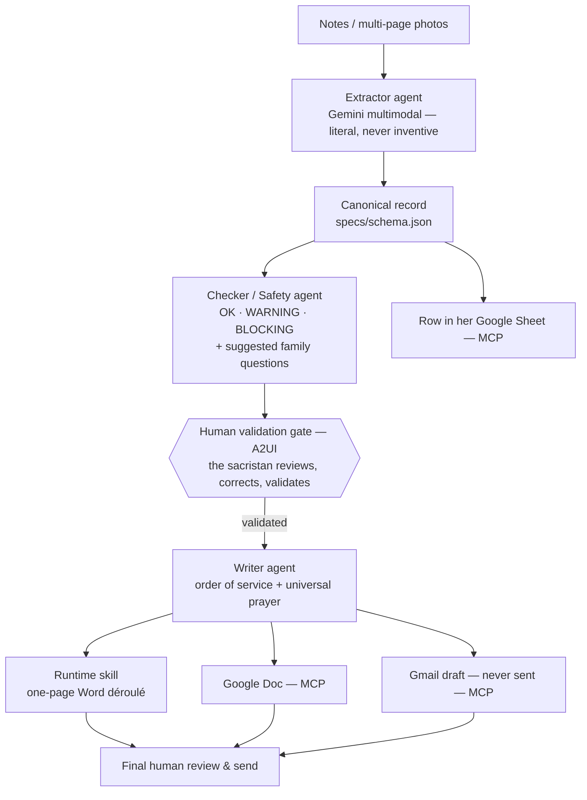

🌍 **English** · [Français](README.fr.md)

# Assistant Obsèques
### A Human-in-the-Loop AI Agent for Funeral Ceremony Preparation

> **Kaggle × Google AI Agents Capstone — Concierge Agents track.**
> The AI proposes; the human always decides. Nothing is ever sent automatically.

A sacristan prepares Catholic funeral ceremonies: interviewing grieving
families, deciphering handwritten notes, assembling the order of service,
coordinating with the priest — hours of careful, repetitive work under
emotional pressure. **Assistant Obsèques** turns her free-form notes and
photos into a validated ceremony dossier and its concrete deliverables,
while keeping her in control at every step.

---

## The problem

Every ceremony means: reading multi-page handwritten preparation sheets,
re-typing everything into a one-page order of service, drafting emails to the
priest and the funeral team, and keeping a registry — for someone whose real
job is to be *present for the families*, not to do data entry. Mistakes are
costly: a wrong name, a missed reading, a sensitive topic the family asked to
avoid.

## Why agents?

Each step needs a *narrow* job with its own rules: extraction must be literal
and never inventive; the safety check must be strict and structured; the
writing must be warm but constrained. One big prompt cannot hold all these
tensions at once. A **pipeline of specialized ADK agents** — with a **human
validation gate in the middle** — keeps every step auditable and safe.

## What it does

From free-form interview notes **or multi-page photos** of annotated
preparation sheets, after the sacristan has reviewed and validated the
extracted record, the assistant produces:

- a **polished one-page Word (.docx) déroulé** (order of service) — the tool
  the sacristan works in every day; the primary human-facing deliverable;
- a **Google Doc** — shareable web copy of the same order of service (MCP);
- a **Gmail draft** to the priest and funeral team — **never auto-sent** (MCP);
- **one row in the sacristan's own Google Sheet** — her durable registry, in
  her own Drive (MCP);
- **suggested follow-up questions** for the next family conversation, derived
  from what is missing or uncertain.

## The interface

The sacristan uses a **mobile-first web app**: she photographs her preparation
sheet with her phone, reviews the extracted record on a validation screen
(missing fields flagged, cross-page contradictions alerted, `avoidMentioning`
highlighted), corrects, **validates** — and only then generates the
deliverables. The validation screen uses **A2UI**: it is the
human-in-the-loop heart of the product.

The UI envelope was **prototyped in Google AI Studio and validated with the
actual sacristan before any agent code was written** — knowing what has value
comes before shipping features. Full spec: [`specs/interface.md`](specs/interface.md).

## Architecture



Four ADK agents (Orchestrator, Extractor, Checker/Safety, Writer); `Document`,
`Email` and `Sheet` are **MCP tool calls**, not agents. The one-page Word
déroulé is rendered by a **runtime skill** (rules + proven script), from the
ordered `ceremony.liturgySteps` validated against a real order of service.

## Course concepts demonstrated

| Concept | Where | How |
| --- | --- | --- |
| **ADK multi-agents** | `agents/` | Orchestrator + Extractor + Checker + Writer pipeline |
| **MCP** | `integrations/mcp/` | Google Docs, Gmail, Google Sheets servers |
| **Antigravity 2.0** | whole build | Spec-driven build (`AGENTS.md` + `specs/`), build-time skills, artifacts shown in the video |
| **Security** | `security/`, hooks | Human gate, allow/deny lists, terminal sandboxing, gitleaks pre-commit, fictional-data-only rule |
| **Deployability** | Cloud Run | `adk deploy cloud_run` — private, scale-to-zero, EU region |
| **Agent Skills** | `.agent/skills/` + `skills/` | 2 build-time skills (commit format, secret scan) + 1 runtime skill (Word déroulé formatter) |

## Tech stack

- **Python 3.13** (pinned), **Google ADK** (multi-agent pipeline)
- **Gemini** multimodal (photo/notes extraction) + reasoning (checking, writing)
- **MCP servers**: Google Docs, Gmail, Google Sheets
- **A2UI** validation screen, in a mobile-first web app (`ui/`)
- **Runtime skill**: Node.js one-page Word renderer (`skills/deroule-obseques/`)
- **Deployment**: Cloud Run, `europe-west9` (Paris) — private, scale-to-zero
- **Observability** (bonus): Langfuse via OpenTelemetry, EU region

## Human-in-the-loop & safety

- **Nothing is ever sent automatically.** Emails are drafts; sending is a human act.
- **No invention.** Empty fields render as "à compléter"; doubts go to
  *Points à vérifier*, never silently filled.
- **`avoidMentioning`** travels through the whole pipeline: topics the family
  asked to avoid never appear in any output.
- **A `BLOCKING` status disables generation** until the human resolves it.
- Build-side: terminal sandboxing + allow/deny lists in Antigravity, gitleaks
  pre-commit hook, fictional data only in the repo (hard rule 7).

## Getting started

### Prerequisites
- Python 3.13 · Node.js 20+ · a Google Cloud project (billing enabled)
- `gcloud` CLI authenticated

### Install
```bash
# TODO after scaffold: e.g. uv sync
```

### Configure secrets
```bash
cp .env.example .env
# then fill .env with your own credentials (this file is gitignored)
```

### Run
```bash
# TODO after scaffold: e.g. adk web
```

## Demo & test case

The repo ships a fully **fictional** golden case — **Jeanne Martin, 84** — in
`examples/jeanne_martin/`: two pages of interview notes (`notes.md`) and the
expected extraction (`expected.json`), including missing fields, a WARNING
status and suggested family questions. It drives both the demo and the eval.

## Deployment

```bash
adk deploy cloud_run   # target: europe-west9 (Paris)
```

**Cloud Run** hosts the agents *and* the web interface as one unit: private
(auth-gated — only the sacristan), **scale-to-zero** (near-free for a single
user), **EU region** for GDPR alignment. See `specs/interface.md` for the
full deployment rationale.

## Project structure

```
assistant-obseques/
├── AGENTS.md                # the contract: stack + 8 hard rules
├── specs/                   # architecture, schema, BDD scenarios, interface
│   ├── architecture.md
│   ├── schema.json
│   ├── behaviour.md
│   └── interface.md
├── .agent/skills/           # build-time skills (Antigravity)
├── agents/                  # ADK agents (built in Antigravity)
├── tools/                   # runtime custom tools
├── skills/deroule-obseques/ # runtime skill: one-page Word renderer
├── integrations/mcp/        # MCP config (Docs, Gmail, Sheets)
├── ui/                      # A2UI validation screen / web app
├── security/                # allowlists, guardrails, data policy
├── eval/                    # LLM-as-judge eval (Jeanne Martin case)
├── examples/jeanne_martin/  # fictional golden case
└── docs/                    # diagrams, captures
```

## Evaluation

An **LLM-as-judge** eval runs the pipeline on the Jeanne Martin case and
scores the extraction against `expected.json` — including the *absence of
invention* (missing fields must stay missing).

## Method: value before features

Ten days before the competition, the UI was prototyped in **Google AI Studio**
and validated with the actual end user. With AI, delivering functionality is
easy; knowing what is valuable and useful is the real work. The competition
build is the production system behind that validated screen: AI Studio for
discovery → Antigravity for the build → ADK/MCP for the system → Cloud Run
for delivery.

## Roadmap

- **v1 (competition):** full pipeline, validation gate, four deliverables,
  Cloud Run deployment, eval, observability.
- **Post-competition (the real product):** hardened authentication, daily-use
  UX polish for a non-technical user, ceremony history, photo robustness.

## Data & privacy

- Ceremony data lives in the **sacristan's own Google Sheet / Drive** — no
  third-party database.
- **EU processing target** (`europe-west9`, Paris).
- The repository contains **fictional data only**.
- Raw photos are not persisted server-side beyond processing.

## License

MIT — see [LICENSE](LICENSE).
