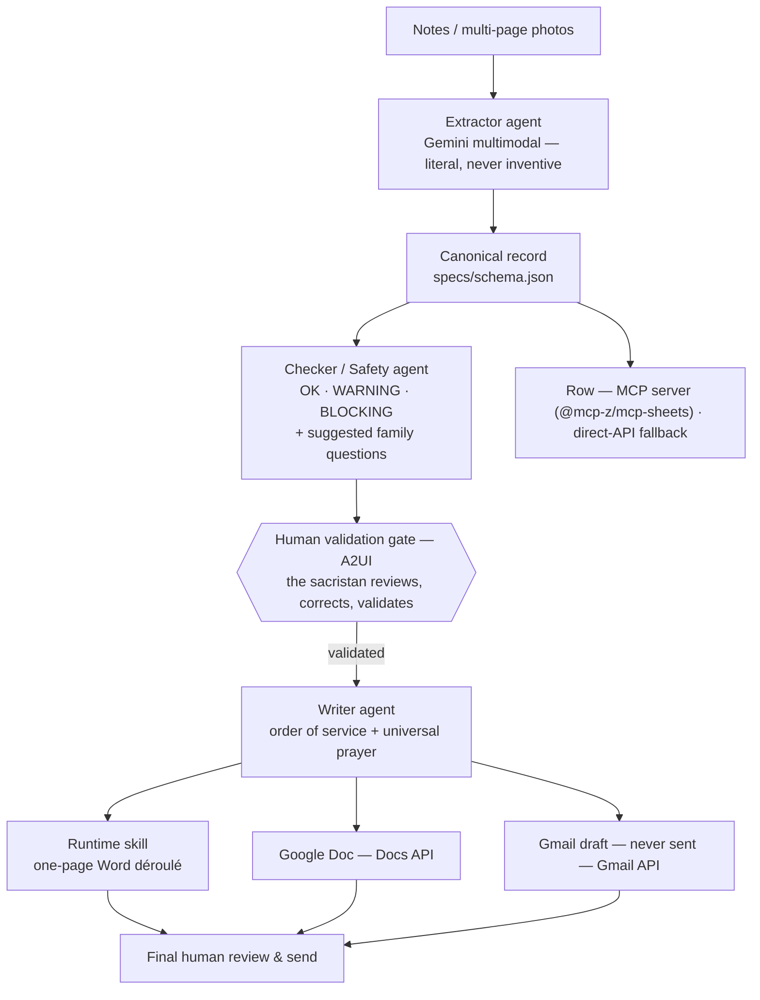

🌍 **English** · [Français](README.fr.md)

# Assistant Obsèques
### A Human-in-the-Loop AI Agent for Funeral Ceremony Preparation

> **Kaggle × Google AI Agents Capstone — Concierge Agents track.**
> The AI proposes; the human always decides. Nothing is ever sent automatically.

A sacristan prepares Catholic funeral ceremonies: interviewing grieving
families, deciphering handwritten notes, assembling the order of service,
coordinating with the priest — hours of careful, repetitive work under
emotional pressure. **Assistant Obsèques** turns her free-form notes and
photos into a validated ceremony dossier and its concrete deliverables,
while keeping her in control at every step.

---

## The problem

Every ceremony means: reading multi-page handwritten preparation sheets,
re-typing everything into a one-page order of service, drafting emails to the
priest and the funeral team, and keeping a registry — for someone whose real
job is to be *present for the families*, not to do data entry. Mistakes are
costly: a wrong name, a missed reading, a sensitive topic the family asked to
avoid.

## Why agents?

Each step needs a *narrow* job with its own rules: extraction must be literal
and never inventive; the safety check must be strict and structured; the
writing must be warm but constrained. One big prompt cannot hold all these
tensions at once. A **pipeline of specialized ADK agents** — with a **human
validation gate in the middle** — keeps every step auditable and safe.

## What it does

From free-form interview notes **or multi-page photos** of annotated
preparation sheets, after the sacristan has reviewed and validated the
extracted record, the assistant produces:

- a **polished one-page Word (.docx) déroulé** (order of service) — the tool
  the sacristan works in every day; the primary human-facing deliverable;
- a **Google Doc** — shareable web copy of the same order of service (Google Docs API);
- a **Gmail draft** to the priest and funeral team — **never auto-sent** (Gmail API — draft only);
- **one row in the sacristan's own Google Sheet** — her durable registry, in
  her own Drive (MCP server — direct-API fallback);
- **suggested follow-up questions** for the next family conversation, derived
  from what is missing or uncertain.

## The interface

The sacristan uses a **mobile-first web app**: she photographs her preparation
sheet with her phone, reviews the extracted record on a validation screen
(missing fields flagged, cross-page contradictions alerted, `avoidMentioning`
highlighted), corrects, **validates** — and only then generates the
deliverables. The validation screen uses **A2UI**: it is the
human-in-the-loop heart of the product.

The UI envelope was **prototyped in Google AI Studio and validated with the
actual sacristan before any agent code was written** — knowing what has value
comes before shipping features. Full spec: [`specs/interface.md`](specs/interface.md).

## Architecture



Four ADK agents (Orchestrator, Extractor, Checker/Safety, Writer). Document
and Email are **direct Google API calls** (Docs API, Gmail API — drafts only);
the Sheet write is **MCP-first** (`@mcp-z/mcp-sheets` via stdio) **with
automatic API fallback**. The one-page Word déroulé is rendered by a **runtime
skill** (rules + proven script), from the ordered `ceremony.liturgySteps`
validated against a real order of service.

## Course concepts demonstrated

| Concept | Where | How |
| --- | --- | --- |
| **ADK multi-agents** | `agents/` | Orchestrator + Extractor + Checker + Writer pipeline |
| **MCP** | `tools/mcp_clients.py`, `integrations/mcp/` | Real MCP runtime path: registry writes go through the `@mcp-z/mcp-sheets` MCP server (stdio, service-account auth); tools discovered at runtime via `list_tools()` (26 tools), `rows-append` selected, arguments mapped from the discovered `inputSchema` (`id` / `gid` / `rows` / `headers`). Automatic direct-API fallback on any error; every call records `integration_path` (`mcp` \| `api_fallback` \| `api`). Proven by `eval/test_mcp_sheets.py`. |
| **Antigravity 2.0** | whole build | Spec-driven build (`AGENTS.md` + `specs/`), build-time skills, artifacts shown in the video |
| **Security** | `security/`, hooks | Human gate, allow/deny lists, terminal sandboxing, gitleaks pre-commit, fictional-data-only rule |
| **Deployability** | Cloud Run | Dockerfile + `gcloud run deploy` — application-gated (Google Sign-In), scale-to-zero, EU region |
| **Agent Skills** | `.agent/skills/` + `skills/` | 2 build-time skills (commit format, secret scan) + 1 runtime skill (Word déroulé formatter) |

## Tech stack

- **Python 3.13** (pinned), **Google ADK** (multi-agent pipeline)
- **Gemini** multimodal (photo/notes extraction) + reasoning (checking, writing)
- **MCP**: `@mcp-z/mcp-sheets` (stdio) for the registry, feature-flagged (`USE_MCP` / `USE_MCP_SHEETS` / `USE_MCP_GMAIL`, `SHEET_GID`) with automatic direct-API fallback · **Google APIs** (`googleapiclient`): Gmail drafts, Docs
- **A2UI** validation screen, in a mobile-first web app (`ui/`)
- **Runtime skill**: Node.js one-page Word renderer (`skills/deroule-obseques/`)
- **Deployment**: Cloud Run, `europe-west9` (Paris) — application-gated, scale-to-zero
- **Observability** (bonus): Langfuse via OpenTelemetry, EU region

## Human-in-the-loop & safety

- **Nothing is ever sent automatically.** Emails are drafts; sending is a human act.
- **No invention.** Empty fields render as "à compléter"; doubts go to
  *Points à vérifier*, never silently filled.
- **`avoidMentioning`** travels through the whole pipeline: topics the family
  asked to avoid never appear in any output.
- **A `BLOCKING` status disables generation** until the human resolves it.
- Build-side: terminal sandboxing + allow/deny lists in Antigravity, gitleaks
  pre-commit hook, fictional data only in the repo (hard rule 7).

## MCP-first, with graceful fallback

The Sheet integration follows a **MCP-first** design: `append_ceremony_row`
opens a stdio session to `@mcp-z/mcp-sheets`, discovers its tools at runtime
via `list_tools()` (never guesses tool names), selects `rows-append`, and maps
arguments from the tool's own `inputSchema`. On *any* error the same function
falls back to the direct `googleapiclient` SDK — every call records its
`integration_path` (`mcp` | `api_fallback` | `api`) for observability.

Three upstream quirks were found by reading the server's source and neutralized
with labeled minimal workarounds:

1. **Unconditional `GOOGLE_CLIENT_ID` validation** — `@mcp-z/oauth-google`
   v1.0.6 calls `requiredEnv('GOOGLE_CLIENT_ID')` before the
   `auth === 'service-account'` branch; a labeled dummy satisfies the check.
2. **`file://C:/` URIs on Windows** — Node's URL parser treats the drive
   letter as the URL host; `keyv-registry`'s `resolveFilePath` then doubles it
   (`C:\C:\…`). Override with `file://~` store URIs.
3. **Child environment** — built from the MCP SDK's `get_default_environment()`
   instead of `os.environ`, so no API key or session secret is ever handed to
   third-party server code.

On Cloud Run the service runs with `USE_MCP_SHEETS=false` by design: even
though the container ships Node.js (for the Word-déroulé skill), spawning a
community MCP server via `npx` at request time would add a supply-chain pull
and cold-start latency to a bereavement-critical path. Production therefore
uses the hardened direct-API path; the MCP path is exercised and proven locally
and by the test suite (`integration_path=mcp`).

## Getting started

### Prerequisites
- Python 3.13 · Node.js 20+ · a Google Cloud project (billing enabled)
- `gcloud` CLI authenticated

### Install
```bash
pip install -e .          # Python deps (pinned to 3.13)
npm install               # Node deps (docx package for the Word skill)
cp .env.example .env      # then fill .env with your own credentials (gitignored)
```

### One-time OAuth consent (Gmail + Drive)
```bash
python agents/auth.py     # opens a browser; grant Gmail + Drive scopes
                          # creates token.local.json (gitignored, never committed)
```

### Run
```bash
python ui/app.py          # http://localhost:8002 — AUTH_MODE=off by default locally
```

### Test
```bash
python eval/test_mcp_manual.py     # 30-second MCP proof (no Gemini pipeline)
python eval/test_mcp_sheets.py     # MCP happy path + fallback + flag-off
python eval/test_auth.py           # 7 auth-gate assertions
python eval/test_edit_survival.py  # full pipeline proof (LLM + Google APIs)
python eval/run_all.py             # all 8 suites
```

## Demo & test case

The repo ships a fully **fictional** golden case — **Jeanne Martin, 84** — in
`examples/jeanne_martin/`: two pages of interview notes (`notes.md`) and the
expected extraction (`expected.json`), including missing fields, a WARNING
status and suggested family questions. It drives both the demo and the eval.

---

## Deployment (Cloud Run) — optional

Local run is fully supported (see above) and deployment is optional per the
competition rules. Our instance runs in **europe-west9** (Paris), network-open
but **application-gated** (Google Sign-In + email allowlist).

### Prerequisites

```bash
gcloud services enable \
  run.googleapis.com cloudbuild.googleapis.com artifactregistry.googleapis.com \
  secretmanager.googleapis.com drive.googleapis.com gmail.googleapis.com \
  sheets.googleapis.com generativelanguage.googleapis.com
```

### Identities

- **Service account** — the service *runs as* a no-role SA whose only power is
  Editor on the sacristan's registry Sheet (shared by the owner).
- **Owner's OAuth consent** — one-time, via `python agents/auth.py` (Desktop
  client, scopes `gmail.readonly + gmail.compose + drive.file`); produces a
  token uploaded as a secret.
- **Web OAuth client** — for the login screen (authorized JS origins: the
  `*.run.app` URL + `http://localhost:8002`); its client ID becomes
  `GOOGLE_WEB_CLIENT_ID`.
- **Gemini API key** — `GOOGLE_API_KEY` env var.

### Secrets

```bash
# 1. Gmail/Drive OAuth token (from local consent)
gcloud secrets create gmail-oauth-token \
  --data-file=token.local.json

# 2. Gemini API key
echo -n "YOUR_API_KEY" | \
  gcloud secrets create google-api-key --data-file=-

# 3. Session cookie signing key
openssl rand -base64 48 | \
  gcloud secrets create session-secret --data-file=-

# Grant the SA access to all three
for s in gmail-oauth-token google-api-key session-secret; do
  gcloud secrets add-iam-policy-binding $s \
    --member="serviceAccount:SA_EMAIL" \
    --role="roles/secretmanager.secretAccessor"
done
```

> 🚨 **No key, token or password ever enters the image, the repo, or the
> Dockerfile.** `.gcloudignore` and `.dockerignore` exclude `.env`,
> `*.local.*`, `service-account.json`, `test_photos/`, and `eval/real_cases/`.

### Deploy

```bash
gcloud run deploy assistant-obseques \
  --source . \
  --region europe-west9 \
  --allow-unauthenticated \
  --service-account SA_EMAIL \
  --memory 1Gi \
  --max-instances 1 \
  --set-secrets \
    GMAIL_TOKEN_JSON=gmail-oauth-token:latest,\
    GOOGLE_API_KEY=google-api-key:latest,\
    SESSION_SECRET=session-secret:latest \
  --set-env-vars "^;^EXTRACTOR_MODEL=gemini-3.5-flash;\
WRITER_MODEL=gemini-3.5-flash;\
SHEET_ID=your-sheet-id;\
USE_MCP_SHEETS=false;\
ALLOWED_EMAILS=sacristine@example.com,pere.bernard@example.com;\
SACRISTAN_EMAIL=sacristine@example.com;\
AUTH_MODE=on;\
AUTH_HTTPS_ONLY=true;\
GOOGLE_WEB_CLIENT_ID=your-web-client-id.apps.googleusercontent.com;\
AUTH_ALLOWED_EMAILS=sacristine@example.com"
```

**Notes:**
- `^;^` — custom separator because `ALLOWED_EMAILS` contains commas.
- `USE_MCP_SHEETS=false` — the currently deployed revision predates the MCP
  code; no redeploy needed for judging. This flag matters on the next deploy.
- `--max-instances 1` — the demo uses in-memory single-session state by design.
- `--allow-unauthenticated` — the gate lives in the **application**, not in IAM
  (Google Sign-In + email allowlist; see Security notes below).

### Security notes

- **Network-open by design** — the gate lives in the application: server-side
  Google ID token verification + email allowlist. Same allowlist philosophy as
  the recipient belt (no email leaves the system to an unknown address).
- **Least privilege everywhere** — the SA has no roles beyond Sheet Editor;
  OAuth scopes are narrow (`gmail.compose`, never `gmail.send`; `drive.file`,
  not `drive`).
- **OAuth app in Testing mode** — refresh tokens expire ~7 days. Production
  path: verified consent screen. IAP prototyped as the enterprise path
  (requires a Workspace org) — documented as a next step.
- **Source upload hygiene** — `.gcloudignore` / `.dockerignore` keep secrets,
  tokens and real-case data out of the build context.
- **Emails are drafts** — `gmail.compose` scope, `drafts.create` only. No
  `gmail.send`, no send scope, anywhere.
- **Teardown after judging** — delete the Cloud Run service + secrets, rotate
  any keys used during the demo.

### Observability (optional)

Langfuse tracing is opt-in.  Set three env vars (or Cloud Run secrets):

| Variable | Example | Purpose |
|---|---|---|
| `LANGFUSE_PUBLIC_KEY` | `pk-lf-...` | Public key from your Langfuse project |
| `LANGFUSE_SECRET_KEY` | `sk-lf-...` | Secret key |
| `LANGFUSE_HOST` | `https://cloud.langfuse.com` | Langfuse host (EU cloud recommended) |

**Privacy default:** traces carry operational metadata only (model id, duration,
step count, status).  Note/record content is **never** sent unless
`LANGFUSE_TRACE_CONTENT=true` — intended for fictional dev runs only.
When no keys are set, the telemetry module is a silent no-op.

### Next steps

- **IAP** for organization-wide access control (requires a Workspace org).
- **Per-session state store** for multi-user (replace in-memory global).

## Project structure

```
assistant-obseques/
├── AGENTS.md                # the contract: stack + 8 hard rules
├── specs/                   # architecture, schema, BDD scenarios, interface
│   ├── architecture.md
│   ├── schema.json
│   ├── behaviour.md
│   └── interface.md
├── .agent/skills/           # build-time skills (Antigravity)
├── agents/                  # ADK agents (built in Antigravity)
├── tools/                   # runtime custom tools
├── skills/deroule-obseques/ # runtime skill: one-page Word renderer
├── integrations/mcp/        # MCP config (Docs, Gmail, Sheets)
├── ui/                      # A2UI validation screen / web app
├── security/                # allowlists, guardrails, data policy
├── eval/                    # LLM-as-judge eval (Jeanne Martin case)
├── examples/jeanne_martin/  # fictional golden case
└── docs/                    # diagrams, captures
```

## Evaluation

An **LLM-as-judge** eval runs the pipeline on the Jeanne Martin case and
scores the extraction against `expected.json` — including the *absence of
invention* (missing fields must stay missing).

## Method: value before features

Ten days before the competition, the UI was prototyped in **Google AI Studio**
and validated with the actual end user. With AI, delivering functionality is
easy; knowing what is valuable and useful is the real work. The competition
build is the production system behind that validated screen: AI Studio for
discovery → Antigravity for the build → ADK/MCP for the system → Cloud Run
for delivery.

## Roadmap

- **v1 (competition):** full pipeline, validation gate, four deliverables,
  Cloud Run deployment, eval, observability.
- **Post-competition (the real product):** hardened authentication, daily-use
  UX polish for a non-technical user, ceremony history, photo robustness.

## Data & privacy

- Ceremony data lives in the **sacristan's own Google Sheet / Drive** — no
  third-party database.
- **EU processing target** (`europe-west9`, Paris).
- The repository contains **fictional data only**.
- Raw photos are not persisted server-side beyond processing.

## License

MIT — see [LICENSE](LICENSE).
