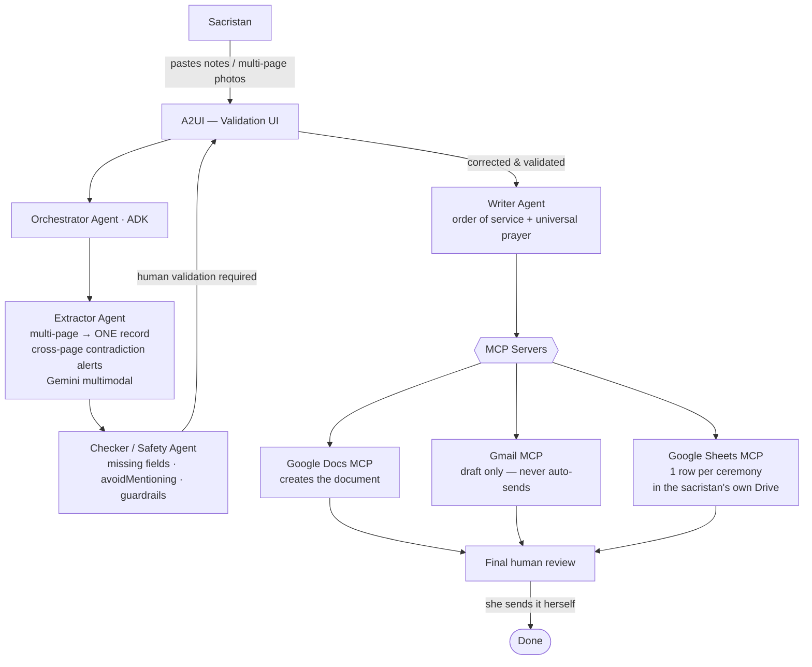

<!-- 🌍 Language: **English** · [Français](README.fr.md) -->

# Assistant Obsèques
### A Human-in-the-Loop AI Agent for Funeral Ceremony Preparation

> **This project does not try to automate grief. It automates the repetitive
> administrative work so that a sacristan can spend more time accompanying
> families with care, attention, and humanity.**

<!-- TODO: replace with a real cover image (required for the Kaggle Writeup) -->
<!--  -->

**Track:** Concierge Agents · **Built with:** Google ADK · MCP · A2UI · Antigravity 2.0

- 🔗 **Live demo / project link:** <!-- TODO -->
- 🎥 **5-min video:** <!-- TODO: YouTube link -->
- 📝 **Writeup:** <!-- TODO: Kaggle Writeup link -->

---

## The problem

Preparing a Catholic funeral ceremony takes a sacristan hours of sensitive,
repetitive work. They meet the family, take notes on the deceased's
personality, the family's wishes, the readings, hymns, readers, and prayer
intentions — often across **several handwritten pages**. Later, they re-type
everything by hand, build the order of service, and email the priest and the
funeral team.

This work is repetitive, emotionally sensitive, and error-prone: a forgotten
reader, a missing hymn, the wrong attachment, the wrong recipient, or a clumsy
phrasing in a grieving context.

<!-- TODO: 2–3 sentences making it concrete and human -->

## Why agents?

<!-- The rubric explicitly asks "Why agents? How can agents uniquely help?" Answer it head-on. -->

The task is naturally a **pipeline of focused, specialized steps** — extract,
check, write, review — where each step benefits from a narrow prompt and a
narrow set of tools. A single monolithic prompt would dilute attention and
hallucinate. A team of specialized ADK sub-agents keeps each step sharp,
auditable, and safe, while a human stays in control at every gate.

## What it does

1. The sacristan pastes free-form interview notes — or photographs her
   annotated preparation sheets (**multi-page**: several photos or PDF pages
   at once).
2. An **Extractor agent** consolidates everything into **one** structured
   record — inventing nothing, flagging what's missing, and **alerting on
   cross-page contradictions** (page 1 says 10:30, page 3 says 11:00).
3. A **Checker / Safety agent** surfaces missing required fields, sensitive
   details to avoid, and inconsistencies.
4. The sacristan **reviews and corrects** everything in an A2UI validation
   screen.
5. A **Writer agent** generates a sober order of service and a universal prayer.
6. Via **MCP servers**, the system creates a **Google Doc**, a **Gmail draft**
   (**never sending anything automatically**), and appends **one row per
   ceremony to the sacristan's own Google Sheet** — her durable registry, in
   her own Drive.
7. The sacristan reads, validates, and sends it herself.

**Core principle: the AI proposes, the human validates.**

## Architecture

<!-- TODO: also export a polished docs/architecture.png for the video/writeup.
     GitHub renders mermaid natively, so this already works as a real diagram. -->



## Course concepts demonstrated

<!-- This table maps the mandatory course concepts to exactly where a judge can
     find them. Fill the "Where to find it" column with real paths/links. -->

| Concept | Demonstrated in | Where to find it |
| --- | --- | --- |
| **Agent / Multi-agent system (ADK)** | Code | `agents/` — Orchestrator + Extractor + Checker + Writer sub-agents |
| **MCP Server** | Code | `integrations/mcp/` — Google Docs, Gmail & **Google Sheets** MCP servers (consumed, not hand-wrapped) |
| **Antigravity 2.0** | Video | Built in Antigravity 2.0 (IDE + command center) — shown at `mm:ss` in the demo video |
| **Security features** | Code + Video | Email allowlist, data minimization, no-auto-send, `avoidMentioning` guardrail, terminal sandboxing — `security/` |
| **Deployability** | Video | Deployed via Agents CLI to Agent Engine (Gemini Enterprise Agent Platform), see "Deployment" |
| **Agent skills** | Code + Video | `.agent/skills/` (build-time) + Agents CLI workflow ; bonus: runtime skill `skills/` (one-page Word order-of-service formatter) |

> Minimum required: 3 of 6. This project demonstrates <!-- N -->/6.

## Tech stack

- **Agent framework:** Google Agent Development Kit (ADK)
- **Reasoning models:** Gemini <!-- TODO: exact models --> — EU region target
  (`europe-west9`, Paris) <!-- confirm model availability at wiring time -->
- **Tool interoperability:** MCP (Google Docs, Gmail drafts, Google Sheets)
- **Persistence:** the sacristan's own **Google Sheet** (one row per ceremony
  — no third-party database)
- **Generative UI:** A2UI for the human validation screen
- **Coding environment:** Antigravity 2.0 (IDE + command center) + Agents CLI
- **Deployment:** Agent Engine (Gemini Enterprise Agent Platform)
- **Evaluation:** LLM-as-judge over a fixed test case
- **Observability (bonus):** Langfuse via OpenTelemetry (EU region)

## Human-in-the-loop & safety

- **Nothing is ever sent automatically.** Emails are created as *drafts* only.
- **No invention.** Missing information is returned as `null` and flagged, never
  guessed. Fields extracted from handwriting are marked `needsHumanReview`.
- **The data stays with the user.** Ceremony records live in the sacristan's
  **own Google Sheet, in her own Drive** — not on a third-party server. Raw
  photos are not stored in the Sheet.
- **Data minimization** on sensitive personal, family, and religious data;
  EU-region processing as design target (GDPR).
- **`avoidMentioning`** field: topics the family asked not to raise are carried
  through the whole pipeline and enforced by the Safety agent.
- **Email allowlist + roles** (admin / sacristan / priest / team). No public
  access, no family access in v1.
- **Retention:** demo data is fictional; production data would be deleted or
  anonymized after a defined period.

## Getting started

### Prerequisites
<!-- TODO: pin versions -->
- Python <!-- 3.x -->
- Google ADK <!-- version -->
- A Google Cloud project with Gemini <!-- API / Agent Platform --> enabled
- Node.js <!-- if needed for the A2UI frontend -->

### Install
```bash
git clone https://github.com/MaryleneH/assistant-obseques.git
cd assistant-obseques
# TODO: install command, e.g.
pip install -r requirements.txt
```

### Configure secrets
> 🚨 **Never commit API keys or passwords.** Use environment variables.
```bash
cp .env.example .env
# then fill .env with your own credentials (this file is gitignored)
```
<!-- .env.example lists the required vars, incl. optional LANGFUSE_* keys -->

### Run
```bash
# TODO: run command, e.g.
adk run agents/orchestrator
```

## Demo & test case

The repo ships with a **fictional** end-to-end example (no real personal data):

> Funeral of Mme Jeanne Martin, 84, Tuesday July 7 at 10:30 at Saint-Martin
> church. Discreet, faithful, devoted to her grandchildren. Her son Pierre will
> read the first reading. Entrance hymn "Trouver dans ma vie ta présence".
> Do not dwell on her illness. Priest: Father Bernard. Send the order of service
> to pere.bernard@example.com and equipe.obseques@example.com.

<!-- TODO: add a demo GIF — docs/demo.gif -->
See `examples/jeanne_martin/` for the input notes (including the multi-page
photo set) and the expected structured output.

## Deployment

<!-- Ticks the "Deployability" concept. Deploying to a live public endpoint is
     not required for judging, but documenting it (and showing it in the video)
     scores. -->
```bash
# TODO: e.g.
agents-cli deploy
```
<!-- Target: Agent Engine (Gemini Enterprise Agent Platform). Use the exact
     names the tooling displays; describe how to reproduce + required IAM/scopes. -->

## Project structure
```
.
├── AGENTS.md                # hard rules for the coding agent (root, multi-tool standard)
├── specs/                   # BDD spec, JSON schema, target architecture
├── .agent/skills/           # BUILD-TIME skills for Antigravity (engineering habits)
├── agents/                  # ADK sub-agents (orchestrator, extractor, checker, writer)
├── tools/                   # custom RUNTIME tool code (e.g. photo extraction call)
├── skills/                  # RUNTIME skills (e.g. one-page Word order-of-service formatter)
├── integrations/mcp/        # MCP config (Docs, Gmail, Sheets)
├── ui/                      # A2UI validation screen
├── security/                # allowlist, guardrails, data-handling policy
├── eval/                    # LLM-as-judge evaluation
├── examples/jeanne_martin/  # fictional test case
├── docs/                    # diagrams, captures
├── README.md                # English (this file)
└── README.fr.md             # French (product-facing, for the sacristan)
```

## Evaluation

A lightweight **LLM-as-judge** eval scores the extraction and the generated
order of service against acceptance criteria on the fixed Jeanne Martin case:
does it invent fields? does it flag missing ones? is the tone sober? is the
`avoidMentioning` constraint respected? Agent runs are traced with **Langfuse**
(OpenTelemetry) to make the multi-agent cascade observable.
<!-- TODO: point to eval/ and summarize results -->

## Roadmap

- **Edge-first vision:** on-device extraction (Gemini Nano / Gemma via Google AI
  Edge) so a photo of handwritten notes never leaves the phone — inspired by
  Google AI Edge Gallery. *Designed for, not yet built.*
- Multi-parish support, role-based dashboards, richer liturgical assistant.

## Data & privacy

All data in this repository is **fictional**. No real family, deceased,
priest, or team information is included. The design assumes sensitive data in
production and applies minimization, human validation, no auto-send, user-owned
storage (the sacristan's Google Sheet), EU-region processing as target, and a
retention policy.

## Team & acknowledgments

<!-- TODO -->
Built for the Kaggle × Google *5-Day AI Agents: Intensive Vibe Coding* capstone.

## License

MIT — see [LICENSE](LICENSE).
