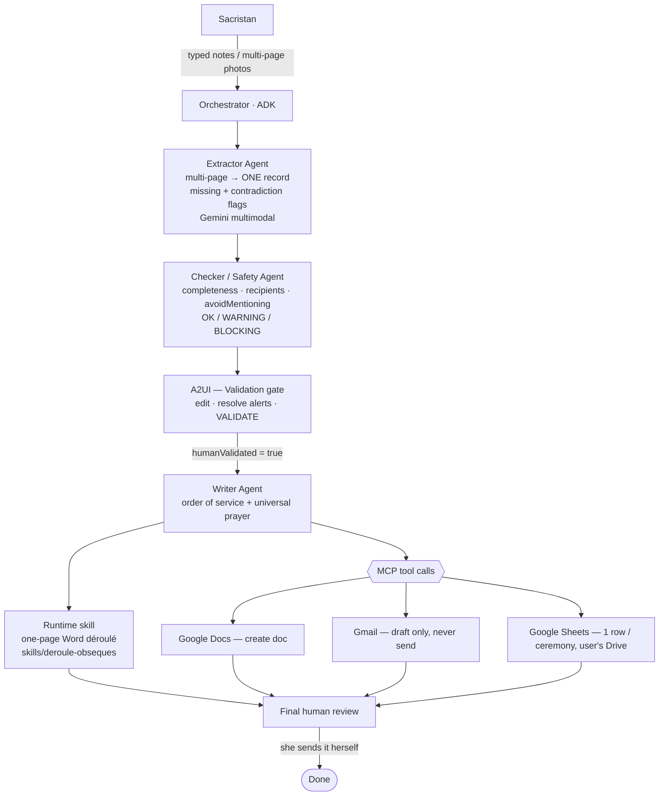

# Architecture — Assistant Obsèques

Design document indexed by the coding agent. Companion files: `schema.json`
(canonical record), `behaviour.md` (BDD acceptance scenarios).

## 1. Overview

The system is a **pipeline of specialized ADK agents** with a **human
validation gate** in the middle. Notes (typed or multi-page photos) are
extracted into one structured record, checked for safety and completeness,
**reviewed and validated by the sacristan**, then used to generate the order of
service and a universal prayer, and to produce the concrete deliverables:

- a **polished one-page Word (.docx) order of service** — *the tool the
  sacristan works in every day*, so it is the primary human-facing deliverable;
- a **Google Doc** (shareable web copy of the same order of service);
- a **Gmail draft** to the priest and funeral team (never auto-sent);
- **one row in the sacristan's own Google Sheet** (her durable registry).

**Why agents (and not one big prompt).** Each step needs a *narrow* job, prompt,
and tool set: extraction must be literal and never inventive; the safety check
must be strict and structured; the writer must be warm but constrained. Splitting
these into focused ADK sub-agents keeps each step auditable and safe, and lets
the human intervene at exactly one well-defined gate.

## 2. The agent team (ADK)

| Agent | Role | Input | Output | Model |
| --- | --- | --- | --- | --- |
| **Orchestrator** | Runs the pipeline, enforces the human gate, calls MCP tools | user notes / photos | final artifacts | reasoning |
| **Extractor** | Multi-page notes → **one** structured record; flags missing, alerts contradictions, marks handwriting `needsHumanReview` | notes / photos + `schema.json` | populated record | **multimodal** |
| **Checker / Safety** | Validates completeness, recipients, contradictions, `avoidMentioning`; emits `OK / WARNING / BLOCKING` | record | `qualityCheck` block | reasoning |
| **Writer** | Sober order of service + universal prayer; no invention; respects `avoidMentioning` | **validated** record | order of service + prayer | reasoning |

`Document`, `Email`, and `Sheet` are **not** agents — they are **MCP tool calls**
made by the orchestrator after validation.

**Runtime skill — one-page Word déroulé (`skills/deroule-obseques/`), in v1
scope.** After validation, the orchestrator also invokes a packaged product
skill (rules + Node.js script, ported from the author's battle-tested personal
skill) that renders the validated order of service as an elegant **one-page A4
Word document** — the format the sacristan actually works in. It renders from
**`ceremony.liturgySteps`** (the ordered rubric list: label / hymn-book
reference / italic title / assignment note), mapped 1:1 to the script's
`etapes`; the named song/reading fields (`entranceSong`, `gospel`…) are
**projections** of those steps, kept for the Checker's required-field logic
and the Sheet's flat columns. It renders only
(no invention; `null` fields become "à compléter"; `avoidMentioning` holds) and
self-verifies the one-page constraint via PDF conversion. **Cut order if
Saturday overruns:** the Google Doc is the cuttable output (MCP is already
proven via Gmail + Sheets); the Word document stays — it is the
sacristan-facing deliverable and it strengthens the Agent-skills concept.

## 3. Data flow



**The gate is hard:** the Writer and all MCP writes are unreachable until
`security.humanValidated == true`, and a `BLOCKING` quality status prevents
validation until resolved.

## 4. State machine (`status`)

```
draft → notes_added → extracted → needs_review → ready_for_generation
      → ceremony_generated → quality_checked → document_created
      → email_draft_created → validated → archived
```

The human gate sits at `needs_review → ready_for_generation`.

## 5. Persistence — the Google Sheet

One **row per ceremony**, in the **sacristan's own Drive**. Flat columns for
scalars; two JSON columns for the list-shaped fields; a `status` column so she
can see at a glance what is in progress vs done.

| Column | Source |
| --- | --- |
| `caseId`, `status`, `updatedAt` | system |
| `deceased_firstName`, `deceased_lastName`, `deceased_age` | record |
| `date`, `time`, `church`, `celebrant` | record |
| `entranceSong`, `firstReading`, `psalm`, `gospel`, `meditationSong`, `finalFarewellSong` | record |
| `priestEmail`, `teamEmails` | record |
| `avoidMentioning` | record |
| `readers_json`, `intentions_json` | record (lists) |
| `liturgy_json`, `nextMass` | record (ordered liturgical steps, serialized) |
| `documentLink`, `emailDraftCreated` | after MCP calls |

**Never** write raw photos or unstructured blobs to the Sheet.

## 6. Human-in-the-loop — the A2UI screen

Shows the extracted record as an **editable form**, with: the Checker's alerts,
per-field confidence indicators, the `avoidMentioning` list highlighted, and
buttons **Correct / Validate / Generate**. Validation is only enabled when
status is not `BLOCKING`. Validating sets `humanValidated = true` and unlocks
the Writer + MCP writes.

*Fallback:* A2UI is young (v0.9). If it blocks progress for more than a few
hours, ship a minimal equivalent web screen — the human-in-the-loop *behaviour*
matters more than the specific tech.

## 7. Security & privacy

- **No auto-send** — Gmail drafts only (no send scope).
- **Allowlist + roles** — only allowlisted emails (admin / sacristan / priest /
  team) get access. No public access, no family access in v1.
- **`avoidMentioning`** enforced end-to-end.
- **Data minimization** — structured fields only; no raw photos persisted.
- **EU region** (`europe-west9`, Paris) as processing target (GDPR).
- **Secrets** in env vars only.
- **Antigravity** — terminal sandboxing on; allow/deny + browser allow lists.

## 8. Deployment, evaluation, observability

- **Deploy:** Agents CLI → Agent Engine (Gemini Enterprise Agent Platform).
  A live public endpoint is *not* required for judging; document the procedure.
- **Eval:** LLM-as-judge over `examples/jeanne_martin/` — does it invent
  fields? flag missing ones? keep a sober tone? respect `avoidMentioning`?
- **Observability (bonus):** Langfuse via OpenTelemetry
  (`GoogleADKInstrumentor().instrument()` + env vars, EU region). Set up early
  so the whole build is traced; harvest the multi-agent cascade for the video.

## 9. Course concepts → where they live

| Concept | Where |
| --- | --- |
| Multi-agent (ADK) | `agents/` — orchestrator + 3 sub-agents |
| MCP server | `integrations/mcp/` — Docs, Gmail, Sheets |
| Antigravity 2.0 | build shown in the video (IDE + command center) |
| Security | `security/` + Antigravity config |
| Deployability | Agents CLI → Agent Engine (documented) |
| Agent skills | `.agent/skills/` (build) + Agents CLI + **runtime skill `skills/deroule-obseques/`** (rules + script, v1 scope) |

## 10. Open assumptions to confirm at wiring

- Exact Gemini model IDs and their `europe-west9` availability.
- First-party MCP servers for Docs / Gmail / Sheets and their auth/scopes
  (fallback: the official Google APIs, but MCP is preferred).
- Gmail MCP **draft-attachment** capability: if unsupported, the `.docx` is
  produced for the sacristan to attach herself at send time — one more human
  touchpoint, consistent with the design.
- A2UI v0.9 suitability vs the minimal-web-screen fallback.
